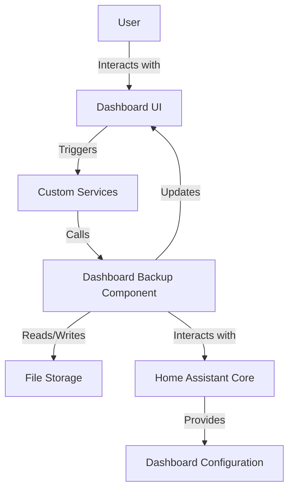
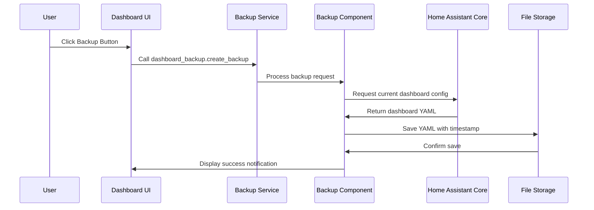
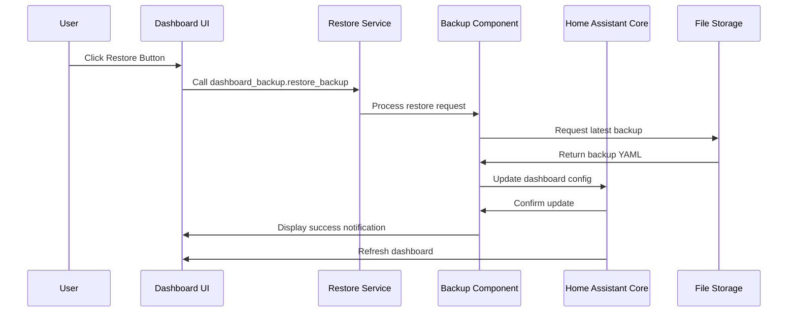

# System Patterns: Home Assistant Dashboard Backup

## System Architecture
The Home Assistant Dashboard Backup solution follows a modular architecture that integrates with Home Assistant's existing systems:

## Key Components

### 1. Custom Component (`dashboard_backup`)
- Core functionality module registered with Home Assistant
- Provides services for backup and restore operations
- Handles file operations and error management
- Manages configuration and integration setup

### 2. Services
- `dashboard_backup.create_backup`: Captures and saves the current dashboard configuration
- `dashboard_backup.restore_backup`: Restores the dashboard from the most recent backup
- Services are exposed to Home Assistant for triggering via UI or automations

### 3. Storage Management
- Stores backups in a dedicated directory within Home Assistant's configuration directory
- Uses timestamped filenames for version tracking
- Implements file rotation to manage storage usage

### 4. UI Integration
- Custom buttons added to the dashboard via Lovelace cards
- Notification system for operation feedback
- Simple configuration via YAML or UI

## Design Patterns

### 1. Service Pattern
- Component exposes well-defined services to Home Assistant
- Services have clear inputs and outputs
- Operations are atomic and transactional

### 2. Repository Pattern
- Abstracts storage operations from business logic
- Handles file I/O, naming conventions, and retrieval

### 3. Observer Pattern
- Component listens for service calls
- Notifies Home Assistant of operation results
- Updates UI based on operation outcomes

### 4. Facade Pattern
- Simplifies complex Home Assistant API interactions
- Provides a clean interface for dashboard operations

## Data Flow

### Backup Process

### Restore Process

## Technical Constraints
- Must work within Home Assistant's component architecture
- Should not modify core Home Assistant files
- Must handle different dashboard configurations (YAML and UI-configured)
- Should be compatible with various Home Assistant installation methods
- Must respect Home Assistant's security model
